<h1 align="center">Hello there!</h1>

---

I'm a Software Engineering student at the University of Waterloo. I love coding, math, and everything in between! That includes cryptography and cybersecurity among other areas. I'll never know all there is to know, but I'm always trying to learn more. When I'm not exploring the untamed wilds of the internet, I'm probably reading science fiction or fixing my computer after somehow breaking it again...

  

